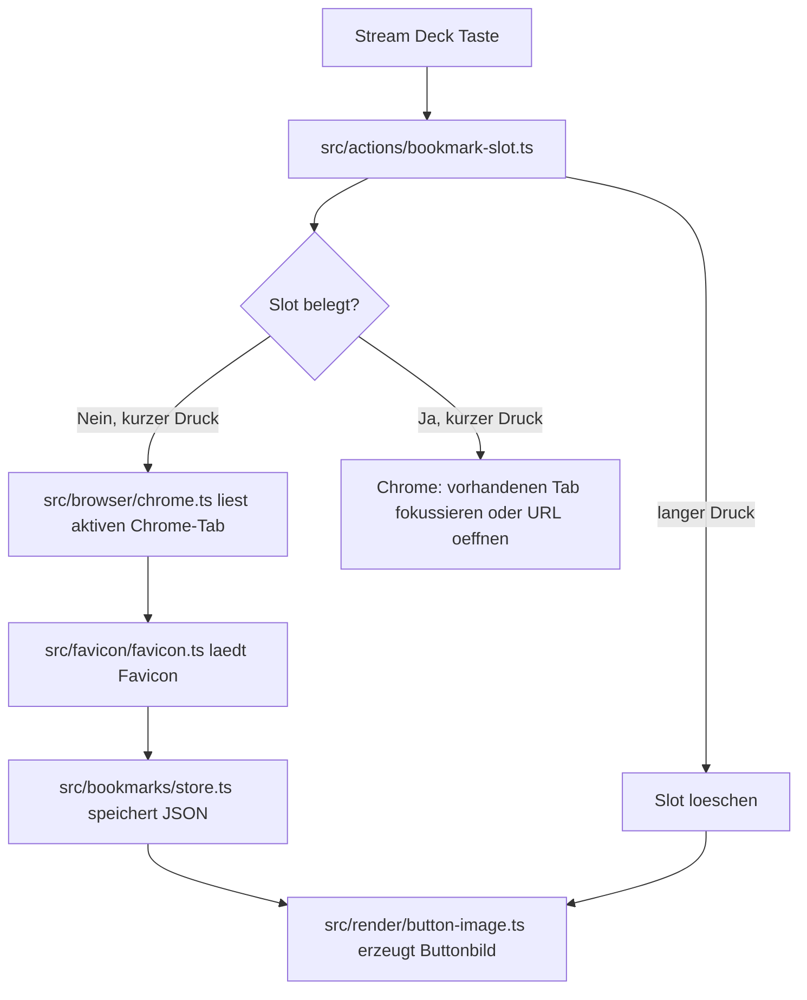

# Architektur

## Kurzueberblick

**Bookmark Slots** ist ein lokales Stream-Deck-Plugin fuer macOS.
Jede Stream-Deck-Taste ist eine Instanz derselben Aktion `Bookmark Slot`.
Die Taste merkt sich ueber ihre Einstellungen nur eine Slotnummer.
Der eigentliche Bookmark liegt zentral in einer JSON-Datei.

## Hauptfluss



## Stream-Deck-Ebene

Die Plugin-Metadaten liegen hier:

```text
com.carlosanderssohn.bookmark-slots.sdPlugin/manifest.json
```

Wichtig:

- `UUID`: `com.carlosanderssohn.bookmark-slots`
- Action-UUID: `com.carlosanderssohn.bookmark-slots.bookmark-slot`
- Runtime: `bin/plugin.js`
- Property Inspector: `ui/bookmark-slot.html`
- Node-Version in Stream Deck: `20`

Der gebaute Runtime-Code wird nach:

```text
com.carlosanderssohn.bookmark-slots.sdPlugin/bin/plugin.js
```

geschrieben. Der Ordner `bin/` ist Build-Ergebnis und nicht Quellcode.

## Runtime-Einstieg

```text
src/plugin.ts
```

Diese Datei:

- erzeugt den Bookmark-Store
- registriert `BookmarkSlotAction`
- schreibt einen Start-Logeintrag
- verbindet das Plugin mit Stream Deck

## Tastenlogik

```text
src/actions/bookmark-slot.ts
```

Diese Datei ist die zentrale Steuerung:

- merkt sichtbare Tasten und ihre Slotnummern
- vergibt automatisch die naechste freie Slotnummer
- erkennt kurzen vs. langen Tastendruck
- speichert leere Slots
- oeffnet belegte Slots
- loescht bei langem Druck
- aktualisiert alle sichtbaren Tasten mit derselben Slotnummer
- beantwortet Property-Inspector-Anfragen

Long-Press-Regel:

```text
>= 1000 ms gedrueckt halten, dann beim Loslassen loeschen
```

## Speicherung

```text
src/bookmarks/store.ts
```

Produktivdaten:

```text
/Users/carlosanderssohn/.streamdeck-bookmarks/bookmarks.json
```

Format:

```json
{
  "version": 1,
  "slots": {
    "1": {
      "slot": 1,
      "url": "https://example.com",
      "title": "Example",
      "titleOverride": "Optional",
      "browser": "chrome",
      "faviconDataUrl": "data:image/png;base64,...",
      "faviconSource": "google",
      "createdAt": "2026-05-02T12:00:00.000Z",
      "updatedAt": "2026-05-02T12:00:00.000Z"
    }
  }
}
```

Schreibzugriffe sind serialisiert. Das ist wichtig, weil mehrere Tasten fast gleichzeitig speichern oder loeschen koennen.

Wenn `bookmarks.json` korrupt ist oder eine falsche Top-Level-Struktur hat, wird sie gesichert als:

```text
bookmarks.corrupt-<timestamp>.json
```

## Chrome-Steuerung

```text
src/browser/chrome.ts
```

Das Plugin nutzt `osascript` per `execFile`, nicht per Shell-String.

Funktionen:

- `getActiveChromeTab()`: liest URL und Tab-Titel aus dem vordersten Chrome-Fenster.
- `openOrFocusChromeUrl(url)`: sucht exakt dieselbe URL in Chrome; wenn vorhanden, springt es zum ersten Treffer; sonst oeffnet es einen neuen Tab.

Wenn Chrome beim Speichern geschlossen ist, wird nichts gespeichert und Stream Deck zeigt `showAlert`.
Wenn Chrome beim Oeffnen eines belegten Slots geschlossen ist, wird Chrome gestartet und die URL geoeffnet.

## Buttonbild

```text
src/render/button-image.ts
```

Das Buttonbild wird als SVG erzeugt und als Data-URL an Stream Deck gesendet.

Layout:

- 144 x 144 px
- schwarzer Hintergrund
- weisser Text
- oben Zeichen 1-7
- Mitte Favicon ca. 64 x 64 px mit abgerundeten Ecken
- unten Zeichen 8-14

Leerer Slot:

- zeigt `Slot N`
- zeigt Plus/Bookmark-Symbol

## Favicons

```text
src/favicon/favicon.ts
```

V1 nutzt den Google-Favicon-Dienst:

```text
https://www.google.com/s2/favicons?domain=<domain>&sz=128
```

Fallback:

- `chrome://...`
- `file://...`
- `localhost`
- fehlgeschlagener Download

nutzen das interne Chrome-Fallback-Icon.

## Property Inspector

```text
com.carlosanderssohn.bookmark-slots.sdPlugin/ui/bookmark-slot.html
```

Der Einstellungsbereich zeigt:

- Slotnummer, editierbar
- gespeicherte URL, nur Anzeige
- Titel, editierbar als `titleOverride`

Wichtig:

- Action-Settings speichern nur `slot`.
- `titleOverride` wird im gemeinsamen JSON-Slot gespeichert.
- Dadurch bleiben mehrere Tasten mit derselben Slotnummer identisch.

## Installation

```text
install-local.sh
```

Das Script:

1. fuehrt `npm run verify` aus
2. baut das Plugin
3. kopiert es nach:

```text
/Users/carlosanderssohn/Library/Application Support/com.elgato.StreamDeck/Plugins/
```

4. startet Stream Deck nicht automatisch neu

Nach Installation Stream Deck manuell neu starten.
